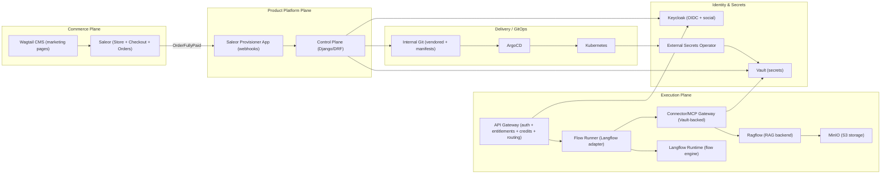

# Architecture — MVP (Saleor + Control Plane + Langflow + Ragflow + MinIO)

**Date:** 2025-12-17

---

## 1. Design Principles
1. **Commerce is separate from provisioning.** Saleor sells; it does not provision.
2. **Control Plane is the source of truth.** Lifecycle, entitlements, wallet, instance state.
3. **Execution is gated.** All user calls go through Gateway; runtime is not publicly exposed.
4. **Secrets never leak.** Flows contain no credentials; Vault + ESO manage secrets.
5. **GitOps-only deployments.** Desired state is committed to internal repos; ArgoCD reconciles.

---

## 2. Component Diagram (Mermaid)

---

## 3. Responsibility Matrix
| Domain | Owner | Notes |
|---|---|---|
| Catalog & checkout | Saleor | Products represent offerings; variants represent plans |
| Marketing pages | Wagtail | Value stream pages + category pages |
| Offering lifecycle/versioning | Control Plane | Immutable versions, publish/pause/EOL |
| Wallet/credits/ledger | Control Plane | Saleor sells credit packs only |
| Runtime selection | Control Plane | shared vs enterprise runtime profiles |
| Provisioning | Control Plane → GitOps | Control Plane commits desired state |
| Execution routing | Gateway | never expose runtime directly |
| Langflow adapter | Flow Runner | stable contract even if Langflow changes |
| Connector execution | Connector/MCP Gateway | pulls secrets from Vault |
| RAG | Ragflow | tenant/project KB scopes, docs in MinIO |

---

## 4. Runtime Profiles
### 4.1 Shared (MVP)
- Shared K8s resources.
- Hard isolation achieved by:
  - zero secrets in flows
  - connector gateway enforcing tenant scope and pulling secrets from Vault
  - tenant-aware data boundaries (Ragflow KB scopes, MinIO prefixes, DB RLS)
  - policy enforcement at Gateway

### 4.2 Enterprise (post-GTM)
- Dedicated namespace minimum.
- Optional vcluster / dedicated cluster.
