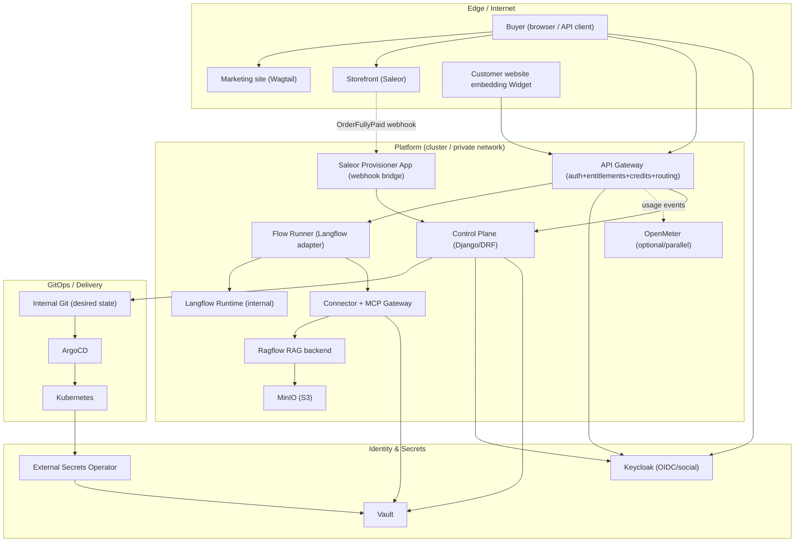
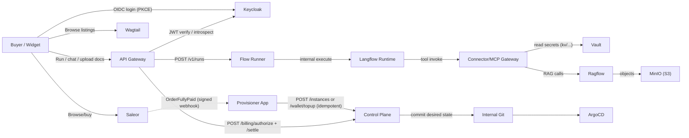
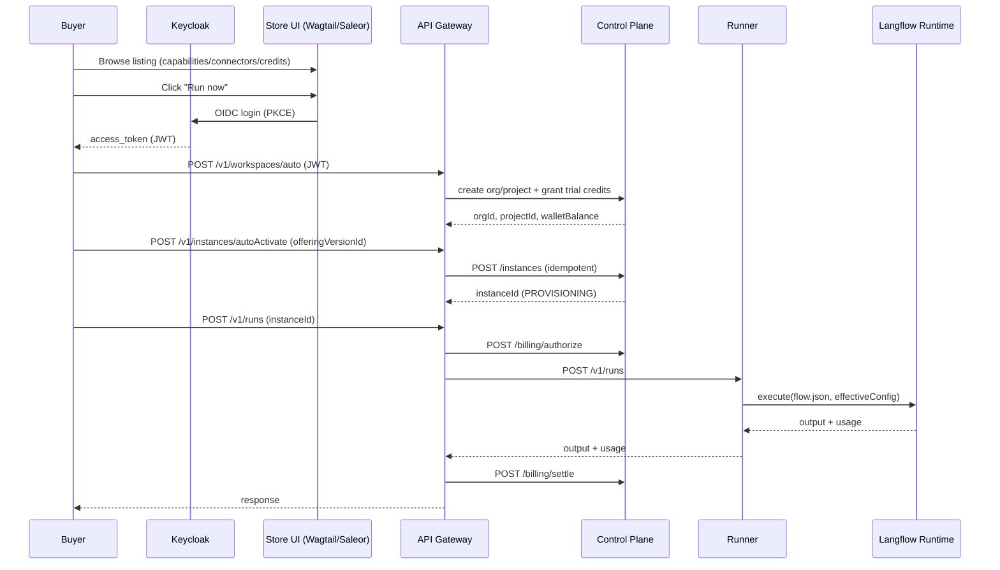
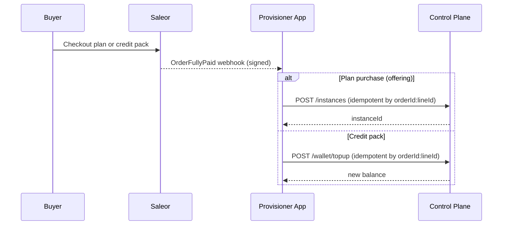
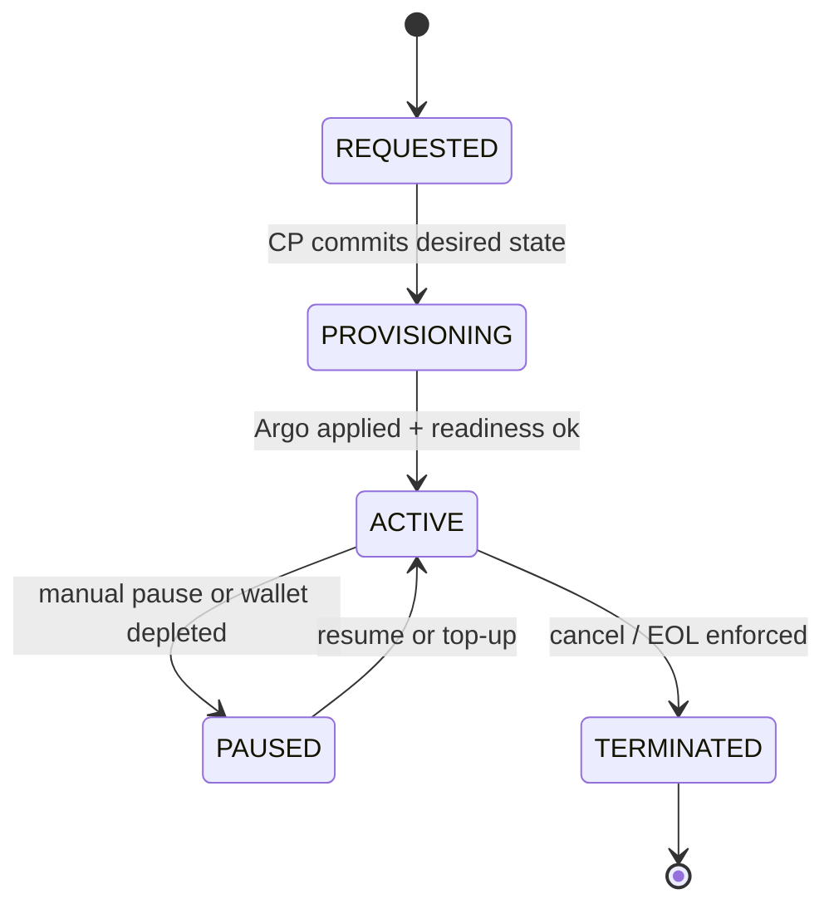
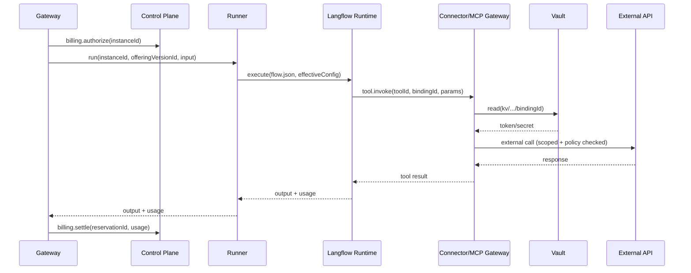
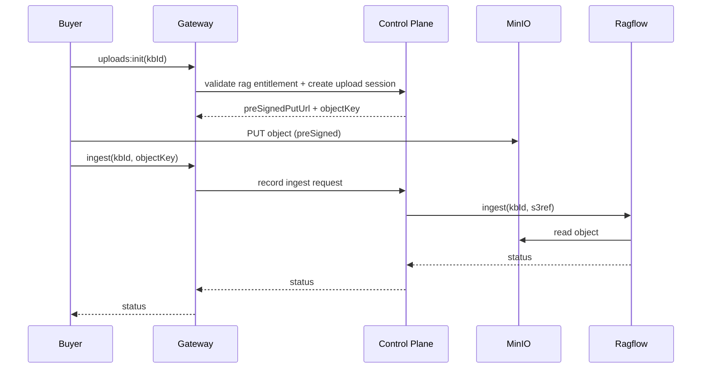
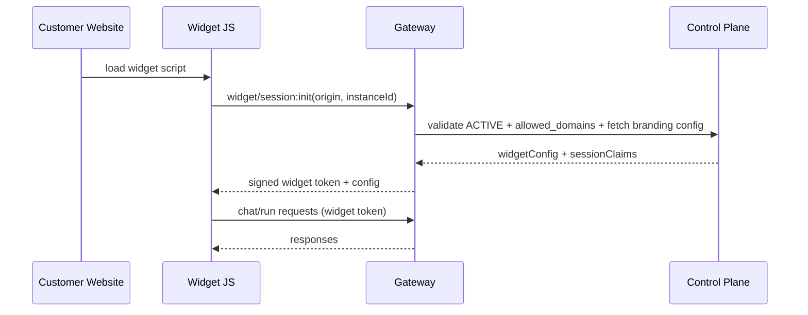
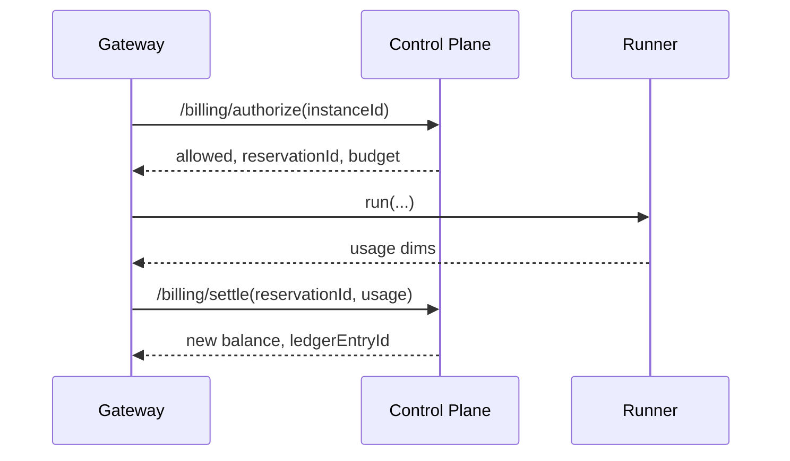
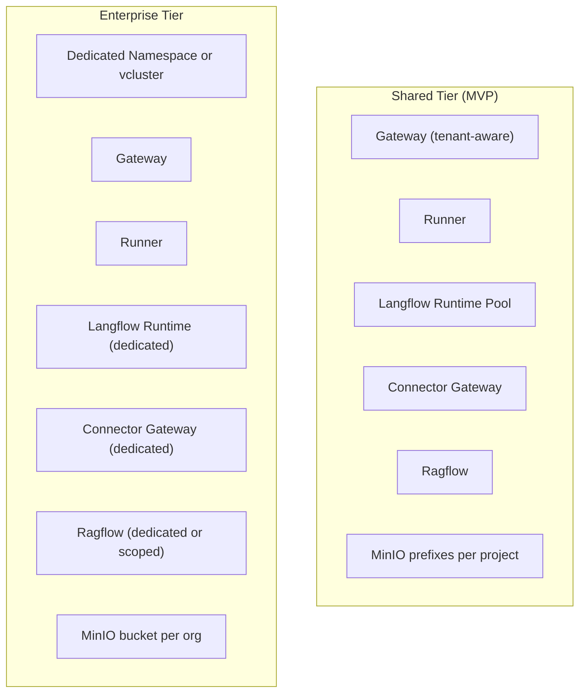

# E2E Visual Architecture — GSV Agent Store (No-Gaps Integration Map)

**Date:** 2025-12-17  
**Audience:** platform engineering, product engineering, security, GTM ops  
**Goal:** provide a complete, implementation-ready, end-to-end visual map of the platform/app store, including **every integration point** across: commerce, CMS, control plane, provisioning, runtime execution, connectors/MCP, RAG, branding/widget, metering/credits, and day‑2 lifecycle.

> Key rule: **Saleor sells**. **Control Plane provisions/controls**. **Gateway executes**. **Secrets live only in Vault**.

---

## 0) Legend (used in all diagrams)
- **Solid arrows** = synchronous API call (HTTP/gRPC)
- **Dashed arrows** = async event (webhook/event bus/log)
- **Locks** = auth boundary (OIDC/JWT/API Key)
- **Vault icon** = secrets boundary (no secrets in flows)
- **GitOps icon** = desired state commit + reconcile

Identifiers (used consistently):
- `orgId`, `projectId`, `teamId`, `userId`
- `offeringId` (stable product), `offeringVersionId` (immutable release)
- `instanceId` (tenant activation of an offering version)
- `runId` (execution), `bindingId` (connector secret binding), `kbId` (knowledge base)

---

## 1) Big picture: Platform planes and trust boundaries

**Non-negotiable boundaries:**
- Buyer never talks to LFRT / Ragflow / MinIO directly.
- Langflow flows never contain credentials; tool calls go to **ConnGW**, which pulls secrets from **Vault**.
- Provisioning happens by **desired state** committed by CP and reconciled by **ArgoCD**.

---

## 2) E2E Integration Points Map (with auth + payload ownership)

---

## 3) Buyer Journey sequences (no gaps)

### 3.1 Browse → Trial “Run now”

### 3.2 Purchase → Provision/Top-up

---

## 4) Provisioning pipeline (GitOps) — exact handoffs

### 4.1 What Control Plane commits per instance (minimum)
- `GatewayRoute` (host/path → instanceId)
- `GatewayPolicy` (capability allowlists, rate limits, payload caps)
- `ConnectorPolicy` (allowed tools/MCP servers)
- Optional: `RagflowKB` + S3 prefix policy
- Optional: `SchedulerJob` (automations)

### 4.2 Instance lifecycle

---

## 5) Execution with connectors + Vault (no secrets in flows)

---

## 6) RAG (Ragflow + MinIO) — ingestion & query

---

## 7) Branding + Web Widget (customer support websites)

### 7.1 Widget session + theming

### 7.2 Source of truth for branding
- Stored as part of **instance effective config** (capability `web_widget.branding`).
- Defaults can be applied per offering/plan; customers override per instance.

Recommended fields:
- `brand_name`, `logo_url`, `avatar_url`
- `primary_color`, `accent_color`, `font_family`
- `launcher_text`, `position`, `allowed_domains`

> This is reflected in `capability-registry.yaml` under `web_widget.branding` in v1.2.

---

## 8) Metering & credits (MVP “sync debit”)

---

## 9) Integration contracts (explicit)

### 9.1 Saleor → Provisioner App
- `OrderFullyPaid` webhook (signed)
- Idempotency: `saleor:orderId:lineId`
- Maps:
  - offering line → `offeringVersionId` + `planId`
  - credit pack line → `creditsAmount`

### 9.2 Provisioner App → Control Plane
- `POST /integrations/saleor/order-paid`
- `POST /instances` (idempotent)
- `POST /wallet/topup` (idempotent)

### 9.3 Gateway → Control Plane
- `POST /billing/authorize`
- `POST /billing/settle`
- `GET /instances/{id}/entitlements`
- `POST /connectors/bindings`
- `POST /connectors/bindings/{id}/revoke`

### 9.4 Langflow → Connector Gateway
- `POST /v1/tools/{toolId}:invoke`

### 9.5 Connector Gateway → Vault
- `kv/data/connectors/{orgId}/{projectId}/{bindingId}`

### 9.6 Control Plane → GitOps
- commit desired state under:
  - `clusters/<env>/instances/<org>/<project>/<instanceId>/...`
- ArgoCD applies; CP marks ACTIVE on readiness

---

## 10) Shared vs Enterprise isolation (visual)

---

## 11) “No-guesswork” checklist (thin slice)
1) Provisioner App: signature validation + idempotency store + mapping rules  
2) Control Plane: offering version upload (hash) + instance state machine + wallet ledger + billing endpoints  
3) Gateway: OIDC + entitlements cache + authorize/settle + routing + widget session init (origin allowlist)  
4) Runner: fetch artifact from MinIO + validate hash + execute + normalize usage  
5) Connector Gateway: allowlists + Vault secret read + audit logs + timeouts/retries  
6) RAG: KB provision + upload/init + ingest + query  
